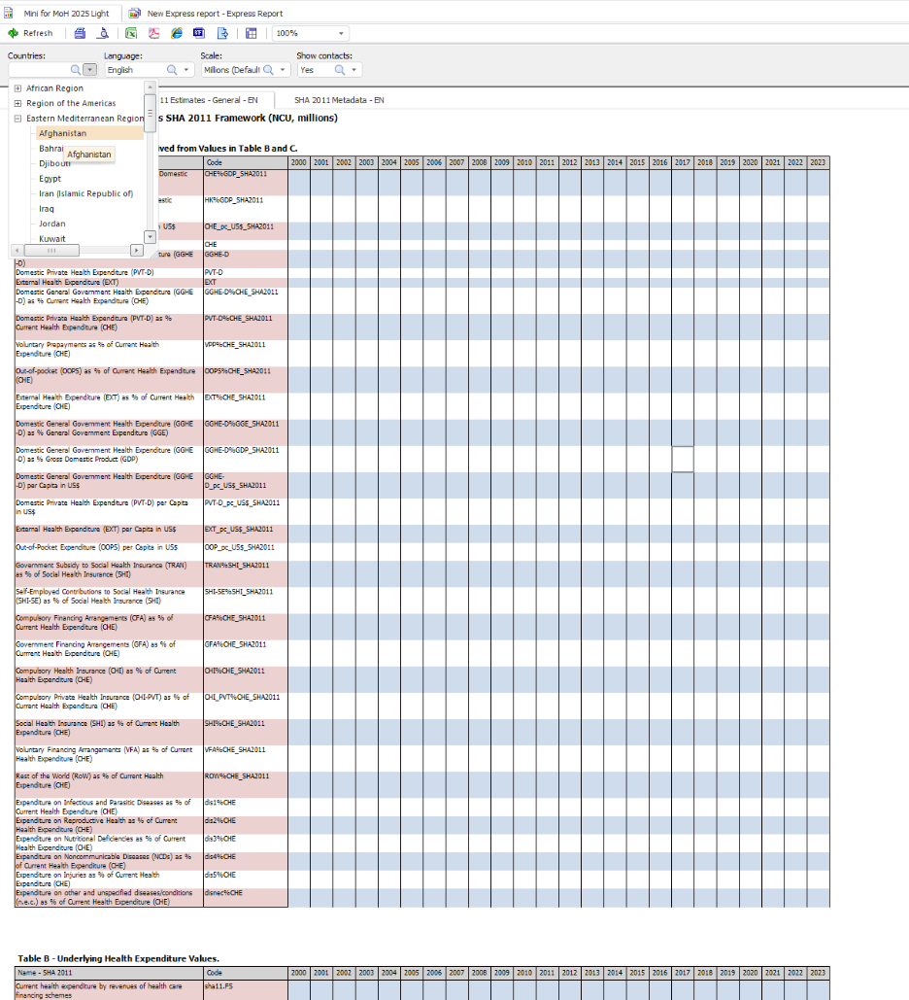
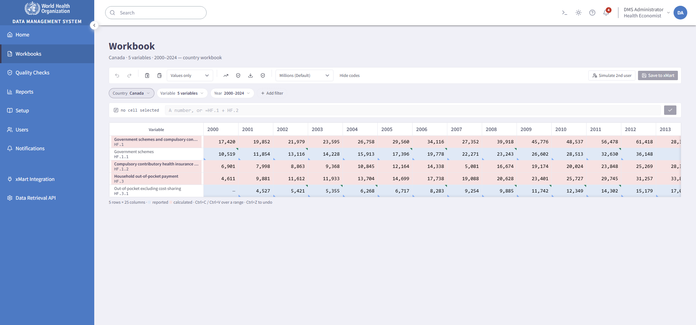

# Demo script — 12 minutes

**WHO Health Accounts DMS prototype · RFP PFD-2026-001**

The click path from [PROTOTYPE_PLAN.md](PROTOTYPE_PLAN.md) §6, with the exact URL for every
beat and the sentence to say while it loads. Timings are cumulative and generous — the whole
path runs in about nine minutes at a normal pace, which leaves three for the panel to
interrupt. **Let them interrupt.** The beats are ordered so that any one of them can be the
last one.

---

## Before you start

```bash
cd dms-prototype
npm ci
npm run build
npm run serve:dist          # → http://localhost:4173
```

**Serve the build, not the dev server.** `npm run dev` recompiles on file change and shows a
Vite overlay if anything is off; the built bundle cannot. `serve:dist` has no dependencies
beyond Node and needs no network, so nothing about the room can break it.

Then, in the browser:

1. Open `http://localhost:4173/` and sign in. Leave the tab on Home.
2. **Set the theme deliberately.** The theme control is in the header. Light is the default
   and matches the WHO reference design; dark is the one that gets an audible reaction on a
   projector. Pick one and stay in it — switching mid-demo invites a question about theming
   that costs two minutes.
3. **Click "Reset demo data" in the header** if you have rehearsed on this browser profile.
   User edits live in `localStorage`, and a workbook still holding yesterday's rehearsal
   values makes the 3:30 beat land wrong.
4. Have this file open on a second screen. The URLs are here so you never have to navigate
   by clicking when you are behind.

**One thing to say once, early, and not again:** *"There is no backend. xMart is mocked
behind a single client interface, and the data is generated deterministically — so what you
are seeing is the same on every machine, and every number on screen is derived rather than
hand-placed."* Saying it once buys credibility. Repeating it sounds defensive.

---

## 0:00 — Sign in, and the dashboard

**URL:** `http://localhost:4173/login` → click **Sign in with WHO account**
**Use cases:** UC001, UC002, UC003, UC006

> *"Sign-in is Microsoft Entra ID — the same account WHO staff already have, no second
> password. This screen is a stand-in for the redirect; the token handling is a design
> commitment in the proposal, not something a front-end prototype should claim to have
> built."*

Land on Home and let it fill in.

> *"UC003 asks for a dashboard of what needs attention. The reporting round and its due
> dates, the publication queue, open quality findings, recent submissions — and the
> completeness heatmap, which is the one screen that tells you at a glance which country and
> which year you are missing."*

Point at one red cell in the heatmap and hover it.

> *"Every cell is a real count over the eleven reported financing-scheme leaves for that
> country and year. Nothing here is a placeholder."*

**If asked about the role switcher in the header:** *"That is a prototype-only affordance,
labelled as such. It exists so I can show you the permission model in one browser instead of
two accounts."*

---

## 1:00 — Setup → Countries

**URL:** `http://localhost:4173/setup?tab=countries`
**Use cases:** UC013, UC014, UC015, UC022

> *"Setup is where the configuration lives — the seven component types from the functional
> requirements, each one a set of records in xMart rather than something hard-coded."*

Three things, in this order:

1. **Scroll the list.** *"All 194 WHO Member States, with the real ISO codes, WHO regions,
   income groups and currencies. This is the actual membership list, not a sample."*
2. **Drag a column header** — grab **Income group** and move it left.
   > *"UC015 asks that a user can reorder columns. The acceptance criterion is that the order
   > survives a reload —"* press **F5** *"— and it does. That is stored per user."*
3. **Point at the "Available for grouping and filtering" line** under the grid, then open
   **Attributes**.
   > *"UC022: an attribute can be flagged as groupable, and this is where the flag is set —
   > region, income group, OECD membership. It is a property of the record, so a new attribute
   > becomes a new way to group without any code. You will see the effect of the flag in a
   > moment, in the country picker: 'add every country in the African Region' is one click,
   > and it is driven by this list."*

   *(Close the dialog without saving.)*

---

## 2:00 — Setup → Formulas

**URL:** `http://localhost:4173/setup?tab=formulas`
**Use cases:** UC029, UC030

> *"All sixteen predefined indicators from HLR8, transcribed verbatim. This is where the
> prototype stops being a mock-up."*

Find **`CHE%GDP_SHA2011`** and click **Inspect**.

> *"That expression is parsed, not string-substituted. Here is the syntax tree, and here is
> the dependency graph: `CHE%GDP` needs `CHE`, `CHE` needs five financing-scheme aggregates,
> and each of those sums its reported children. The engine topologically sorts the graph and
> refuses a cycle — try to make one and it tells you where."*

Point at the **null-guard** column.

> *"Every formula carries its condition. 'At least one component not null' and 'CHE and GDP
> both not null' are different policies, and when a guard fails the result is **blank, not
> zero**. That distinction survives into the Excel export, which is what the requirement
> actually asks for."*

Then the override, which is the beat that closes UC029. Find **`CHE`**, open its country
overrides, and show **Argentina**.

> *"UC029: an administrator can customise a formula for one country without altering it for
> anyone else. Argentina excludes capital expenditure from CHE here — the comment is on
> Argentina's own rows in the RFP's screenshots, so the override has a real provenance. Every
> other country still uses the standard expression."*

---

## 3:00 — Before and after ⭐

**No URL — this is the slide.** Keep the two images side by side.
**Reference:** PROTOTYPE_PLAN.md §2.4

**This is the most important 30 seconds in the demo.** It is the beat that says *we
understood what you already have*, and it is the one the panel will remember.

### The legacy tool



### The same job, in this prototype



Say the **kept** list first, and slowly:

> *"What we deliberately did **not** change: years across the top, variables down the side,
> the scale selector still says 'Millions (Default)', and the row colours still mean what
> they have always meant — blue is a value the country reported, pink is an indicator the
> system calculated. Your team has years of muscle memory in that layout and none of it is
> wasted."*

Then the four replacements, pointing at each:

| Legacy | Replaced with |
|---|---|
| A permanent row of filter dropdowns | **Filter chips** — removable, click to reopen, and serialised to the URL, so a selection is a link you can paste to a colleague |
| Headers scroll away; a 100% zoom control compensates | **Frozen** year row, variable column and corner |
| A paged, fixed table | **Virtualised continuous scroll** — you never paginate a data-entry surface, it breaks range copy and paste |
| Metadata on a separate sheet tab | **Inline metadata**, in a drawer *beside* the grid |

> *"We kept what your team knows and replaced what slows them down."*

**On that last row, if you have a moment:** *"The test we held ourselves to is that reading a
cell's metadata must not lose your place in the data. If it did, we would have rebuilt the
separate-tab problem with nicer styling."*

---

## 3:30 — The workbook, and the engine

**URL:**
`http://localhost:4173/workbooks/view?c=CAN&v=HF.1,HF.1.1,HF.1.2,HF.3,HF.3.1&y=2000-2024&type=country`
**Use case:** UC031

> *"Canada, the financing-scheme dimension, 2000 to 2024. Five variables so you can see the
> whole thing at once; the same screen handles two hundred."*

Click the **`HF.1.1` cell for 2020** and type a new value — **`99999`** — then press
**Enter**.

Watch three things move, and name them as they do:

> *"The leaf I typed. Its parent, `HF.1`, which is a calculated row — pink. And if I add
> `CHE%GDP` to this workbook, that moves too, because the engine walked the dependency graph
> rather than recalculating everything."*

Press **Ctrl+Z**.

> *"Undo is a command stack, not a value snapshot, so the aggregate rolls back with the
> leaf."*

**If asked "how fast is this at scale?"** — *"The grid is a bounded window: one country, one
dimension, twenty-five years is about six thousand cells. The 25-million-row figure in
UC057 describes what comes back from xMart, and that is an API concern — the call log on the
integration page shows every request the app makes."*

---

## 5:00 — Copy, paste as formulas, undo

**Use case:** UC031

Select a range in the Canada workbook — drag from **`HF.1.1` 2018** to **`HF.3.1` 2022** —
and press **Ctrl+C**.

> *"Three copy modes: values, formulas, or values with their metadata. That is not a
> convenience — an analyst moving a series between countries usually wants the *formula*, and
> a plain spreadsheet copy can only give them the number."*

Now switch country. Click the **Country** chip, and before choosing Argentina point at the
**WHO region / World Bank income group / Other groups** headings in the picker.

> *"That is the grouping flag from Setup, doing its job — 'add every country in the African
> Region', or every OECD member, in one click."*

Choose **Argentina**, then press **Ctrl+V**.

> *"Cross-workbook paste. The dialog previews what will land before it commits, and here I
> choose to paste **as formulas** — so Argentina now computes these the same way Canada does,
> against Argentina's own inputs."*

Confirm, then **Ctrl+Z**.

> *"And it is one undo, not twenty-five."*

---

## 6:00 — Metadata, a series gap, and bulk status

**Use cases:** UC024, UC027

Back on Canada. Find a cell with a **small blue triangle in its bottom-left corner** and
click the triangle.

> *"UC027's metadata fields — sources, comments, a web link, estimation method, data type.
> Note where this opened: **beside** the grid, not over it. My cell is still selected, my
> scroll position is intact, and when I close it I am exactly where I was."*

Edit the comment, save, and press **Esc**.

> *"The field order in here is draggable and stored per user — that is UC034, which is not in
> the Pilot scope but is cheap once the fields are data."*

Then select a row that has a **blank cell inside an otherwise complete series** and use the
toolbar's **Fill gaps and extrapolate**.

> *"UC024: filling a gap. Interpolate, carry forward, or apply a growth rate — and whichever
> you pick, the cell is stamped with how it was derived, so a reviewer can see that this is
> an estimate rather than a submission. The dialog previews before it commits, and you can see
> the provenance it will write."*

Finally, select a block of cells and use the toolbar's **Set publishing status in bulk** →
**Ready to publish**.

> *"Publishing status in bulk. It is a per-observation flag, so the alternative is clicking
> six hundred times. Ready-to-publish cells get a green corner marker — same family of corner
> flags as the metadata one, so the grid stays readable instead of growing two more columns."*

---

## 7:00 — Version history and restore

**Use cases:** UC043, UC044

Right-click any cell with a value → **Version history**.

> *"UC043: every prior version of this observation, with who committed it and when. UC044
> bounds it at ten, and it says ten — this is not an unbounded audit log."*

Select two versions and compare, then **restore** one.

> *"And the restore is itself a new version, so nothing is ever actually lost."*

**One line worth adding here:** *"There is a dataset-level restore too, on the integration
page — 'give me this country as it stood on this date' — which is the other half of UC044."*

---

## 8:00 — Quality checks from inside the workbook

**Use cases:** UC052, UC055

Still on Canada. Click **Run quality checks** in the workbook toolbar.

> *"UC052 is specific: run the checks *from* a workbook, and see the result *on the data*."*

Wait for the rings to appear.

> *"Red is an error, amber is a warning, and they are on the cells themselves — I do not have
> to hold a list in my head and go looking. The panel below names every rule that applied and
> how many values it read."*

Click a finding in the panel.

> *"Selecting a finding moves the active cell to the offending value. Reading the problem and
> fixing it are the same motion. The grid never unmounted."*

Then follow the link to the full report and use **Download** (`.xlsx`).

> *"UC055's report, and it downloads. That file is a real spreadsheet, built in the browser."*

---

## 9:00 — The Quality Checks module

**URL:** `http://localhost:4173/quality-checks`
**Use cases:** UC047, UC048, UC053, UC054

> *"Eighteen rules, covering the ten categories UC053 lists — sixteen delivered with the
> system, one an administrator has added, one a user wrote for themselves. Look at the
> badges."*

Point at the three origin badges.

> *"Delivered with the system, added by an administrator, or written by a user for their own
> use. UC050 asks for exactly that distinction, and it matters because a user's rule can be
> promoted to everyone's — so an administrator can see them, while a user's custom *report*
> is private even from an administrator. Those two asymmetries are both in the requirements,
> and we implemented them as written rather than making them consistent."*

Open a rule → show the **UC048 exclusions**.

> *"Country-and-year exclusions, with a one-click reset. A rule that has to be switched off
> because of nine known exceptions gets switched off permanently; a rule with nine
> exclusions keeps working."*

Then the **Thresholds** tab.

> *"UC054's threshold table, administrator-only. Change a number here and the same run
> produces a different set of findings — I can show you that if you want it."*

Run the delivered set (**Run quality checks** → accept the default scope) and open the
**outlier scatter** in the report.

> *"Each point is a country-year against its peer group's median. The rules compare a country
> to its World Bank income group or its WHO region, using a median-and-MAD spread so that the
> outlier cannot inflate the yardstick it is being judged against."*

---

## 10:00 — Reports

**URL:** `http://localhost:4173/reports`
**Use cases:** UC035, UC036, UC042

> *"Six delivered reports, and a builder."*

Open **Full financing matrix (all schemes, all revenues)** → **Edit** to show the builder.

> *"UC036's pivot builder — drag a field into rows, columns, or filters. The values bucket
> takes the five aggregations of the one number an observation carries; there is nothing else
> it could take, because an observation is one value."*

Drag one field between buckets and let the preview redraw.

> *"That preview is live against the real corpus, not a sample."*

Now run it. **Run** → select **five countries** → choose **download** rather than screen.

> *"Currency, unit, scale and language are asked for at run time, per UC035 — the same report
> reads in national currency millions or US dollars per capita without being a different
> report."*

**Optional 20-second beat — UC041.** Before running, set **Report labels** to **French**, run on
screen, and let them read the row labels.

> *"UC041, all six official WHO languages. Headers, classification and indicator labels, the
> totals and both sheets of the Excel file — the same numbers, the report's own vocabulary
> translated. Country names are not translated, and that is the use case's own wording: field
> values stay as registered."*

If asked about Arabic, select it — the limit is on screen and worth saying out loud:

> *"The labels are Arabic. The layout is not mirrored right-to-left — that is a layout project we
> have scoped in the proposal, and the screen says so rather than letting you find it in a
> screenshot."*

While the jobs run, go to **Background jobs**, then let the notification arrive.

> *"UC042: one file per country, generated in the background, and the notification carries a
> working download link."*

Click the link and open one file.

> *"Real `.xlsx`, one per country."*

**Worth saying if the panel is technical:** *"A total that mixes national currencies produces
**no number** — not a wrong one. Summing pesos and yen is the failure that guard exists for,
and the unit label always names the actual currency."*

---

## 11:00 — Users and the permission matrix

**URLs:** `http://localhost:4173/users` then `http://localhost:4173/users/role-permissions`
**Use cases:** UC004, UC007, UC008, UC012

> *"Two roles only, as UC007 specifies: administrator and regular user. An administrator holds
> every regular-user right — there is no capability a regular user has that an administrator
> does not."*

Scroll the list.

> *"And notice what is not here: there is **no delete**. Not disabled, not behind a
> confirmation — it does not exist. UC012 says a user is disabled and retained so that log
> references survive, and the domain layer has no function that could remove one. Every batch
> in xMart names the user who loaded it."*

Try to demote the only administrator.

> *"UC010's guard, and it covers both doors — disabling the last administrator and demoting
> them both empty the role, and both are refused."*

Now `/users/role-permissions`.

> *"UC008's matrix — the six permission levels against the eight modules. What is on this
> screen is what the application enforces; there is no second copy."*

Set **Setup** to **View and export**, save, then switch to **Regular user** in the header and
go to `/setup`.

> *"Same screen, one role change. The create and edit controls are gone — and export is
> still there, because UC007 guarantees a regular user keeps view and export on every module
> they cannot edit. That is a requirement, not a default."*

Switch back to Administrator and press **Reset to delivered** on the matrix.

---

## 11:30 — The retrieval API

**URL:** `http://localhost:4173/integration/retrieval-api`
**Use cases:** Annex 3, UC045, UC046

> *"Annex 3 is thirteen requirements for the API xMart will call on DMS. This screen answers
> all of them on one page."*

Build a request — pick a country, a year range, and a `LastModified` cut-off — and **send**
it.

> *"Filterable by country, by year, by last-modified date. Paged, with a large default page
> size. It reflects deleted records rather than hiding them, and CSV is the response format —
> which is Annex 3's own choice, on the grounds that CSV is a third of the size of JSON and
> tabular by definition."*

**Download the CSV** and open it.

> *"That is the long format from the functional requirements, column for column."*

Then scroll to the evidence table.

> *"Ten of the thirteen rows are demonstrated live. Two — OAuth 2.0 and HTTPS — are marked as
> **design commitments**, because there is no server here and claiming otherwise would be the
> fastest way to lose your trust. That distinction is on the screen, not in a footnote."*

---

## If you have time left

Pick **one**. Do not try to fit two.

- **The developer drawer** (the terminal icon in the header). *"Every call the application has
  made to xMart, with the request it would have sent. This is how we keep ourselves honest
  about where the boundary is."*
- **`/integration?tab=restore`** — UC044's dataset-level restore: *"Canada as it stood on 1
  March."*
- **`/notifications?tab=subscriptions`** — UC058/UC059: *"which events you hear about, with
  thresholds, per user."*
- **Dark theme.** Toggle it on the workbook. *"Both themes pass WCAG AA on every token pair we
  audit, and the audit is a script in the repo, not a claim."*

---

## Questions you should expect, and the honest answer

| Question | Answer |
|---|---|
| *"Is this the real system?"* | *"No. It is the Pilot scope built as a front end against a mocked xMart, so you can click every use case in the proposal instead of reading about it. The developer drawer shows you exactly where the boundary is."* |
| *"How much of the RFP is this?"* | *"All 41 Pilot use cases, plus 12 of the 23 non-Pilot ones. The matrix is in the README, and where something is partial it says so and says why."* |
| *"Where does the data come from?"* | *"It is generated from a seeded hash — the same on every machine, every run. Real ISO codes, real WHO regions, real SHA 2011 classifications, real exchange rates, and the income gradients are unit-tested because an HA economist reads those first."* |
| *"Can it handle 25 million rows?"* | *"That number describes what is retrieved from xMart, and it belongs to the API layer. A workbook is a bounded window of a few thousand cells. The pagination and the incremental `LastModified` pull are both on the retrieval API screen."* |
| *"What is not built?"* | *"Right-to-left layout for Arabic — scoped in the proposal rather than faked. Server-side virus scanning on import, which is called out in the UI where it would happen. And persistence of quality-check findings and generated report files, which need a backend to hold them. All of it is listed in the README's mock-vs-real table."* |
| *"Why is the government financing share different from our published figure?"* | *"The corpus is synthetic. The gradients are right — government share rises with income, out-of-pocket and external financing fall — and the three shares of CHE reconcile, but the country-level numbers are generated, not sourced."* |

---

## If something goes wrong

| Symptom | Do this |
|---|---|
| A page shows an error panel | Click another module in the sidebar. The error boundary is inside the shell, so navigation still works — carry on and come back. |
| The workbook shows stale rehearsal values | **Reset demo data** in the header. Instant: user edits are a diff over generated data. |
| A URL 404s | You are on a static host without SPA rewrite. Use `npm run serve:dist`, not `python -m http.server`. |
| You lose your place in the script | Every beat above has its own URL and no beat depends on the previous one having been performed. Jump to the next one. |
| The panel goes deep on one beat | Let them. Skip to **11:00** (permissions) and **11:30** (the API) — those two are the ones an evaluation panel scores, and both take 30 seconds. |
