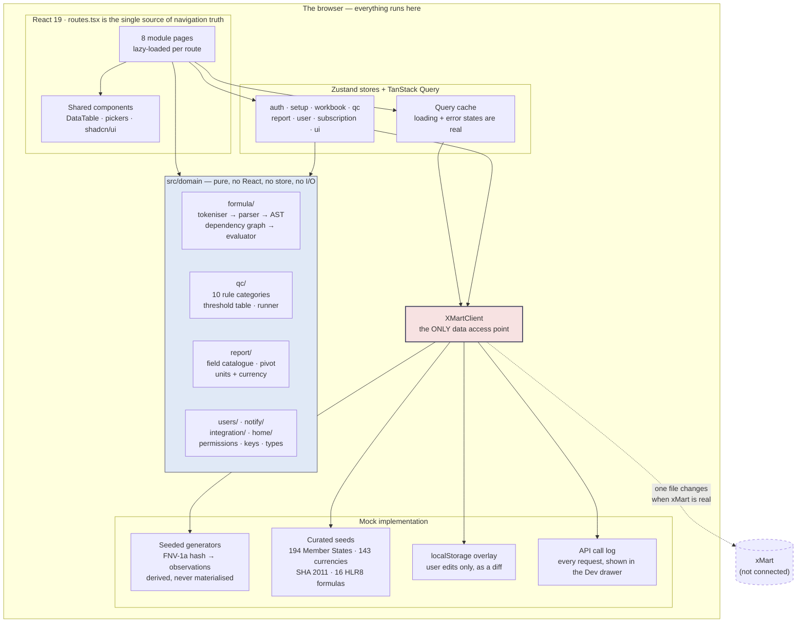

# WHO Health Accounts DMS — Front-End Prototype

A clickable, data-driven prototype of a Health Accounts Data Management System, built as part
of the technical proposal for **RFP PFD-2026-001** (WHO HQ / HSD / PFD — Performance, Planning
and Economics).

It exists so that an evaluation panel can **use** the Pilot scope rather than read about it:
open a workbook, edit a value and watch the indicators recompute, run the quality checks, build
a pivot, flip a permission and watch the controls disappear.

> **There is no backend.** xMart is mocked behind a single client interface and the data is
> generated deterministically, so every run is byte-identical on every machine. Exactly what is
> real and what is simulated is set out in [§4](#4-the-mockreal-boundary) — and, in the running
> application, in the developer drawer behind the terminal icon in the header. Overstating what
> is built is the one thing that loses a WHO bid, so both are deliberately blunt.

| | |
|---|---|
| **Pilot use cases (Y) in the RFP** | 41 |
| **Pilot use cases demonstrable here** | **40 of 41** — 35 fully, 5 with a stated limit. The 41st, UC061 *Phased implementation*, is a delivery plan answered by the proposal rather than by software ([§5](#5-use-case-coverage)) |
| **Non-Pilot (N) use cases covered as a bonus** | **13** fully, 7 partial, 3 not built — 23 of 23 accounted for |
| **Annex 3 API requirements** | 10 of 10 mandatory on one screen — 8 live, 2 stated as design commitments |
| **Unit tests** | 413 |
| **Browser verification checks** | 386 asserted, across 7 harnesses (4 more report values rather than assert) |
| **First-paint transfer** | 225 kB gzipped (was 636 kB before the Phase 8 route split) |

---

## Contents

1. [Running it](#1-running-it)
2. [Verifying it](#2-verifying-it)
3. [Architecture](#3-architecture)
4. [The mock/real boundary](#4-the-mockreal-boundary)
5. [Use-case coverage](#5-use-case-coverage)
6. [Design system](#6-design-system)
7. [Repository layout](#7-repository-layout)
8. [Documents](#8-documents)

---

## 1. Running it

```bash
cd dms-prototype
npm ci
npm run dev                 # → http://localhost:5173
```

Sign in with either demo identity. The **role switcher in the header** toggles Administrator /
Regular user at any time — that is how the permission model is demonstrated in one browser
instead of two accounts, and it is labelled in the UI as a prototype-only affordance.

### For a demo

Serve the **build**, not the dev server:

```bash
npm run build
npm run serve:dist          # → http://localhost:4173
```

`serve:dist` is a 100-line zero-dependency static server in `scripts/serve-dist.mjs`. It exists
for two reasons, both of which have bitten:

- **Deep links need an SPA rewrite.** The app uses `BrowserRouter`, so `/setup` is a real path.
  `vite preview` rewrites it; `python -m http.server` returns **404 for every route except
  `/`**, which breaks every URL in [DEMO_SCRIPT.md](DEMO_SCRIPT.md). The build also writes a
  `404.html` for hosts that honour that convention (GitHub Pages, Netlify, Cloudflare Pages,
  S3 website hosting).
- **Nothing about the room can break it.** No network, no `node_modules` beyond Node itself.

`file://` will not work, and that is a property of the scheme rather than of the build: `file://`
cannot load ES modules (CORS blocks `type="module"`) and has no notion of a path rewrite.

**The 12-minute demo path, with the exact URL and the sentence to say at each beat, is
[DEMO_SCRIPT.md](DEMO_SCRIPT.md).**

---

## 2. Verifying it

### Three gates

```bash
npx tsc -b            # typecheck
npm test              # 413 unit tests
npm run build         # production build
```

### Two static audits — no server, no browser

```bash
npm run audit:contrast    # WCAG 2.1 over 52 token pairs × 2 themes
npm run audit:bundle      # critical-path budget + route-split regression guard
```

Both exit non-zero on a regression, so they are gates rather than reports.
`audit:contrast` also fails if one of the three *documented* light-theme shortfalls has quietly
got worse — "documented" is not allowed to decay into "ignored". `audit:bundle` fails if SheetJS,
Recharts or the datasheet grid reappears on the first-paint path, which is how both bundle
regressions during Phase 8 happened.

### Browser harnesses

Diagnostic, not CI gates. Start a server first:

```bash
npm run dev -- --port 5199
```

| Command | Checks | What it covers |
|---|---|---|
| `npm run verify:shell` | reports | Sidebar and header at 1440 / 768 / 390, permission-filtered navigation |
| `npm run verify:theme` | reports | Both themes, resolved token values, shadcn aliases, toggle persistence |
| `npm run verify:zindex` | 5 | Overlays are not clipped by the fixed chrome |
| `npm run verify:setup` | reports | All 7 Setup tabs, UC015 reorder-survives-reload, admin vs regular |
| `npm run verify:formulas` | reports | All 16 formulas evaluated, AST + dependency graph, cycle refused |
| `npm run verify:workbook` | 34 | The whole workbook demo path, incl. the four §2.4 replacements |
| `npm run verify:qc` | 49 | Rule list, a run, the report, UC048 / UC054, UC052 in the grid |
| `npm run verify:reports` | 51 | Build → save → run 5 countries → 5 `.xlsx` checked on disk |
| `npm run verify:phase7` | 92 | Dashboard, UC010 guard, UC008 matrix, integration, UC044, Annex 3 |
| `npm run verify:keyboard` | 32 | Ctrl+Z/Y, Ctrl+C/V, arrows, Tab/Enter commit, Esc on every overlay |
| `npm run verify:responsive` | 123 | 1920 / 1440 / 1280 / 1024 / 768 × both themes, horizontal-overflow probe |

Screenshots land in `dms-prototype/artifacts/` (gitignored). Point any harness at a production
build with `DMS_URL=http://localhost:4173 npm run verify:workbook`.

---

## 3. Architecture

### Data flow



### Four structural rules

These are enforced by review, and three of the four are enforced by a script or a test too.
They are stated in full in [CLAUDE.md](CLAUDE.md).

| # | Rule | Why it matters to a reviewer |
|---|---|---|
| 1 | **`src/domain/` never imports React, a store or a component.** | It is the only part that survives into production. It is pure, and it holds all 413 unit tests. |
| 2 | **All data access goes through `XMartClient`.** No module reads `db.ts`. | When xMart is real, **one file changes**. That is the claim the boundary table below rests on. |
| 3 | **`src/routes.tsx` is the single source of truth for navigation.** | The sidebar, page titles and permission gates are derived from it, never maintained alongside it. |
| 4 | **Every dependency change is recorded in [DEPENDENCIES.md](DEPENDENCIES.md).** | A bare `npm i @tanstack/react-table` once silently installed v9 — a ground-up API rewrite that would have broken every grid. |

### The formula engine

The technical centrepiece, and the reason the workbook is not a mock-up.

```
"CHE / GDP * 100"
        │
   tokenise ──► variable codes contain . % $ and - (CHE%GDP_SHA2011,
        │       GGHE-D_pc_US$_SHA2011), so refs are matched greedily
        │       against the known-variable set. Never by character class.
        ▼
   recursive-descent parse ──► AST
        │
        ▼
   dependency graph ──► topological order, cycle detection
        │               (CHE%GDP → CHE → HF.1 → HF.1.1 …)
        ▼
   evaluate with a null policy ──► "any-not-null" vs "all-not-null"
        │
        ▼
   a failed guard yields BLANK, NOT ZERO — and that survives into the
   .xlsx export, which is what the requirement actually asks for
```

Both the AST and the dependency graph are inspectable on screen, on
`/setup?tab=formulas` → **Inspect**. A deliberate cycle is refused with the path that closes it.

### Seeded data: derived, not stored

An observation's value is a pure function of `(iso3, year, variableCode)` through a seeded FNV-1a
hash. The "store" is that function plus a small overlay of user edits in `localStorage`.

- **~970,000 observations are derivable; none are materialised.** Any slice costs microseconds,
  which is what makes the UC057 "up to 25 million rows" conversation honest rather than
  hand-waved.
- **Identical on every machine and every reload**, so the demo script never drifts and
  screenshots stay accurate. `Math.random()` is never used for a value — only for the mock
  client's artificial latency.
- **Aggregates are never generated.** Parents and indicators are computed by the formula engine
  from reported leaves. That is deliberate: it is what makes the engine visible.
- **Economic realism is tested, not asserted.** `phase1.test.ts` locks in the income gradients an
  HA economist reads first — out-of-pocket and external financing both fall as income rises,
  government financing rises with it, real reference exchange rates, residual `.nec` buckets stay
  small, and the CHE financing split reconciles (`GGHE-D%CHE + PVT-D%CHE + EXT%CHE` ≈ 100%).
- **Quality-check defects are declared, not emergent**, so Phase 5's findings land at named
  countries and years the demo can navigate to. All ten UC053 categories are covered.
- **Seeded people are fictional.** The RFP names real WHO staff in its distribution list; none of
  them appear as demo records.

---

## 4. The mock/real boundary

The honest version. "Simulated" means the behaviour is real and the transport is not; "design
commitment" means it is described in the proposal and deliberately not faked here.

### Real, in this prototype

| Thing | Detail |
|---|---|
| **The formula engine** | Tokeniser, recursive-descent parser, AST, dependency graph with topological evaluation and cycle detection, 10 functions, both null policies. Production-ready code, 83 tests — 61 on the engine in isolation, 22 against the seeded corpus. |
| **The quality-check engine** | Ten rule categories, the UC054 threshold table, 18 rules, a pure runner with a check budget. Real median-and-MAD outlier statistics. |
| **The pivot engine** | Rows / columns / filters / values, five aggregations, subtotals, per-observation currency conversion before aggregation. |
| **Excel and CSV output** | Real `.xlsx` written in the browser by SheetJS — multi-sheet, with formulas preserved as formulas. Real CSV for the Annex 3 responses. |
| **The permission model** | One matrix (`authStore.regularPermissions`), read by `usePermissions`, written by the UC008 editor, gating every module. No second copy. |
| **The long-format contract** | All 31 xMart columns, in the order the FR's screenshots give them, round-tripped in a test. |
| **The design system** | Every token lifted from the WHO JEE Reporting reference pack. Light and dark, WCAG-audited by a script in the repo. |
| **All 194 WHO Member States** | Real ISO 3166 codes, WHO regions (membership counts asserted in a test), World Bank income groups, OECD flags, 143 currencies with real reference rates. |
| **SHA 2011 classifications** | Transcribed from FR §1. The HF hierarchy is verbatim and asserted as such in a test. |
| **The 16 HLR8 indicators** | Transcribed verbatim, including folder, code, short code, expression, condition and unit. |

### Simulated

| Thing | What is simulated | What is real about it |
|---|---|---|
| **xMart** | The transport. `XMartClient` has one mock implementation reading seeded generators. | The interface, the query shape, the paging, the long-format payload, and an artificial 150–400 ms latency so every loading state in the UI is exercised rather than skipped. |
| **Entra ID sign-in (UC006)** | The redirect and token exchange. The login screen is a stand-in with two demo identities. | The session model, the sign-out, the guard that sends an unauthenticated visitor to `/login`. |
| **API from xMart to DMS (UC045)** | The inbound call. Per-source sync status is seeded. | The screen that shows what arrived, per source, with row counts, batch ids and timestamps. |
| **API from DMS to xMart (UC046)** | The outbound HTTP request. | The payload, the batch id, the author stamp, the accepted/rejected counts, and the entry in the call log. |
| **The Annex 3 retrieval API** | The server. The page builds the request and answers it from the mock store. | The generated request URL, all the filters (country, year range, `LastModified`, `IsDeleted`, paging), and a genuinely downloadable CSV with `Sys_ID` and `Sys_CommitDateUtc` present. |
| **Background report jobs (UC042)** | The queue is `setTimeout`, not a worker. | The job lifecycle, the progress, one real `.xlsx` per country held in memory, and an in-app notification carrying a working download link. |
| **The metadata files in xMart (UC028)** | The file store. | The link out, and the per-field configuration that decides what is shown. |
| **The second concurrent user** | There is one browser. "Simulate 2nd user" fabricates the conflict. | The UC033 locking behaviour and the warning text, quoted verbatim from the RFP. |

### Design commitments — described in the proposal, not built here

| Thing | Why not |
|---|---|
| **OAuth 2.0 on the retrieval API** | No server exists to hold a token endpoint. Marked `design` on the Annex 3 evidence table, never `demonstrated`. |
| **HTTPS-only transport** | Same. A localhost demo is `http://`, and saying otherwise on screen would be false. |
| **Server-side virus scanning on import (UC021)** | A browser cannot scan a file. The import flow validates format and schema and says in the UI where the scan would happen. |
| **Right-to-left layout for Arabic (UC041)** | EN / FR / ES are selectable for report labels; AR / ZH / RU are listed, disabled, and each carries its reason. RTL is a layout project, not a translation table, and it is scoped in the proposal rather than faked. |
| **Persistence of quality-check findings** | A thousand findings per run would fill the same `localStorage` quota the workbook's unsaved edits depend on. Runs are reproducible exactly — the corpus is derived, not sampled — so a reloaded report offers to re-run its scope. Costs a click, not data. |
| **Persistence of generated report files** | Several megabytes of binary, same quota. The notification persists; if its files have been dropped it says so and offers to re-run. |
| **Developing inside WHO xMart (UC056)** | Requires the actual xMart tenant. Answered by the live To-Be architecture diagram on `/integration`, which names the components and where the boundary falls. |

---

## 5. Use-case coverage

All **64** rows from the RFP's own summary table, with the Pilot flag taken from that table
verbatim. Status is the status **in this prototype**:

- **✅ Demonstrable** — click it and it works.
- **◐ Partial** — works with a stated limit. Every limit is named, not glossed.
- **○ Not built** — out of scope for the prototype.

### Shell and Home

| UC | Title | Pilot | Status | Where / limit |
|---|---|---|---|---|
| UC001 | Web based application | **Y** | ✅ | Runs in any browser, no install. `/` |
| UC002 | Access to all modules from home | **Y** | ✅ | Eight module tiles, permission-filtered |
| UC003 | Dashboard displayed in home site | **Y** | ✅ | Reporting round, due dates, publication queue, findings, submissions, completeness heatmap |
| UC003.1 | Different dashboard per role | N | ✅ | An administrator additionally sees the directory and integration health |

### Users

| UC | Title | Pilot | Status | Where / limit |
|---|---|---|---|---|
| UC004 | Users module | **Y** | ✅ | `/users` |
| UC005 | Grant access for a user | **Y** | ✅ | By email, UC011's dialog |
| UC006 | Access with WHO Single Sign-On | **Y** | ◐ | Session model and guard are real; the **Entra ID redirect and token exchange are a design commitment** |
| UC007 | Assign roles to DMS users | **Y** | ✅ | Inline role select; admins implicitly hold every regular-user right |
| UC008 | Edit DMS role permissions | N | ✅ | `/users/role-permissions` — the six UC008 levels × eight modules, with a live capability preview |
| UC009 | Restrict countries for a regular user | N | ✅ | Per-user country restriction, enforced in the workbook and reports |
| UC010 | Temporarily disable a DMS user | N | ✅ | Including the last-administrator guard, which covers **both** disabling and demoting |
| UC011 | Enable a disabled DMS user | N | ✅ | |
| UC012 | DMS users cannot be deleted | **Y** | ✅ | Structural: there is no `deleteUser` function anywhere in the domain layer |

### Setup

| UC | Title | Pilot | Status | Where / limit |
|---|---|---|---|---|
| UC013 | Setup module | **Y** | ✅ | `/setup` — seven URL-addressable tabs |
| UC014 | Import configuration data from xMart | **Y** | ✅ | Every tab reads through `XMartClient`; provenance shown per component |
| UC015 | Reorder columns in all component lists | **Y** | ✅ | Drag-reorderable headers, and the order survives a reload (a regression test, not a nicety) |
| UC016 | Edit predefined list of values | **Y** | ✅ | |
| UC017 | Create a new value for a component | **Y** | ✅ | |
| UC018 | Create new attributes for components | N | ◐ | Attributes can be added with all three types; they are session-scoped configuration, not pushed to xMart |
| UC019 | Edit the details of a component | N | ◐ | The value editor covers a component value; editing the *component definition* is not built |
| UC020 | Delete one value of a component | N | ○ | Proving a value is unused needs a full-corpus scan the front end cannot honestly perform. The LOV editor **states the constraint** instead of faking the check |
| UC021 | Export and import component values | N | ◐ | Round-trips `.xlsx` and `.csv` with a format and schema check. **The virus scan is server-side and is labelled as such in the UI** |
| UC022 | Groups of countries | **Y** | ✅ | Groupable attributes drive the country pickers everywhere |
| UC023 | Countries data reporting follow up | **Y** | ✅ | Contacts, due dates, and a notification sender mounted on the app shell |
| UC024 | Data publishing status flag | **Y** | ✅ | Two states, individually or in bulk, shown as a corner marker |
| UC025 | Predefined crosses | **Y** | ✅ | |
| UC026 | Custom crosses | **Y** | ✅ | Cross builder deriving the notation as you pick dimensions |
| UC027 | Metadata fields for each observation | **Y** | ✅ | All six fields, three types, in the drawer beside the grid |
| UC028 | Access metadata files stored in xMart | **Y** | ◐ | The link and the per-field configuration are real; **the file store is not connected** |
| UC029 | Predefined formulas | **Y** | ✅ | All 16 HLR8 indicators, evaluated live, with per-country overrides |
| UC030 | Custom formulas | **Y** | ✅ | Editor with tokeniser errors, unknown-reference detection and cycle refusal |

### Workbooks

| UC | Title | Pilot | Status | Where / limit |
|---|---|---|---|---|
| UC031 | Workbooks module | **Y** | ✅ | All three axis shapes; view/edit, three-mode copy/paste across workbooks, undo/redo, live recompute, per-cell metadata, filter chips, gap fill and extrapolation |
| UC031.1 | Order workbook data by any element | N | ○ | Row order follows the classification hierarchy, which is what makes the parent/child colouring legible. Arbitrary sort is a roadmap line |
| UC032 | Export workbook data | N | ✅ | `.xlsx`, with formula cells exported as formulas |
| UC033 | Locking functionality | N | ✅ | Including the RFP's warning text verbatim, and a labelled "simulate 2nd user" |
| UC034 | User customized display of metadata fields | N | ✅ | Drag-reorder in the drawer, persisted per user |

### Reports

| UC | Title | Pilot | Status | Where / limit |
|---|---|---|---|---|
| UC035 | Reports module | **Y** | ✅ | `/reports`; unit, currency, scale and language prompted at run time |
| UC036 | Create/edit a predefined report for all users | **Y** | ✅ | Drag-based pivot builder with a live preview against the real corpus |
| UC037 | Custom reports for the user only | N | ✅ | Private **even from an administrator**, exactly as UC037 says — the opposite of UC050, and deliberately not made consistent |
| UC038 | Copy a report as the basis for a new one | N | ✅ | Duplicate-as-custom |
| UC039 | Data tracking reports | **Y** | ✅ | Per-country last-received, series, format, rows, batch |
| UC040 | User customized list of reports | N | ✅ | Favourites and drag-order, both surviving a reload |
| UC041 | Multilanguage report | N | ◐ | EN / FR / ES selectable. **AR / ZH / RU listed, disabled, each with its reason** — Arabic needs RTL layout, which is scoped rather than faked |
| UC042 | Export report to Excel format | **Y** | ✅ | Background queue, one real `.xlsx` per country, notification with a working link |

### Versioning

| UC | Title | Pilot | Status | Where / limit |
|---|---|---|---|---|
| UC043 | Variables, data sets and metadata versioning | **Y** | ✅ | Right-click a cell; author and commit date on every version |
| UC044 | Compare and restore previous versions | **Y** | ✅ | Bounded at 10 as specified, comparable and restorable; plus dataset-level restore as of a date on `/integration?tab=restore` |

### Integration

| UC | Title | Pilot | Status | Where / limit |
|---|---|---|---|---|
| UC045 | API from xMart to DMS | **Y** | ◐ | Per-source sync status, row counts, batches and errors are all real on screen; **the inbound call is simulated** |
| UC046 | API from DMS to xMart | **Y** | ◐ | Payload, batch id, author stamp and accepted/rejected counts are real and logged; **the HTTP request is simulated** |
| UC056 | Develop functionalities in WHO xMart | **Y** | ◐ | Answered by the live To-Be architecture diagram, which names each component and where the boundary falls. **Requires the actual xMart tenant to build** |
| UC057 | Expected processing volumes | N | ◐ | Answered structurally: observations are derived on demand, so any slice is microseconds, and the retrieval API demonstrates paging and incremental `LastModified` pulls. **25 M rows are not seeded** |
| UC060 | Old DMS formulas migration | **Y** | ✅ | Legacy formulas surfaced read-only in their original syntax |
| UC060.1 | Translate old formulas into new syntax | N | ○ | The migration gap is made **visible** rather than closed — that is the point of showing the old syntax verbatim |

### Quality Checks

| UC | Title | Pilot | Status | Where / limit |
|---|---|---|---|---|
| UC047 | Quality Checks module | **Y** | ✅ | `/quality-checks` — rules, thresholds, reports |
| UC048 | Exclude countries from a quality check | **Y** | ✅ | Country-and-year exclusions with a one-click reset |
| UC049 | Create/edit a predefined rule for all users | N | ◐ | An administrator can author a rule visible to everyone, and the origin badge distinguishes it. **The full rule-type builder is not exposed** — new rule *types* are code |
| UC050 | Create/edit a custom rule for the user | **Y** | ✅ | Visible to administrators so one can be promoted — following UC050, **not** UC037 |
| UC051 | Export and import quality check rules | N | ◐ | Round-trips the rule set as a spreadsheet; a regular user cannot import over the delivered set |
| UC052 | Manual run of a quality check from a Workbook | **Y** | ✅ | Cells ring in place; selecting a finding moves the active cell without unmounting the grid |
| UC053 | Predefined quality checks during development | **Y** | ✅ | All ten categories; developer / administrator / user origins visibly distinct |
| UC054 | Configuration values for quality check rules | **Y** | ✅ | Administrator-only threshold table; changing a threshold changes the outcome of the same run |
| UC055 | Generate, visualise and download a QC report | **Y** | ✅ | Findings table, outlier scatter, `.xlsx` and `.csv` download |

### Notifications

| UC | Title | Pilot | Status | Where / limit |
|---|---|---|---|---|
| UC058 | Notifications module | N | ✅ | `/notifications` — inbox and event catalogue, with two real senders |
| UC059 | Create or edit notifications | N | ✅ | Subscriptions with per-event thresholds and country filters, per user |

### Delivery

| UC | Title | Pilot | Status | Where / limit |
|---|---|---|---|---|
| UC061 | Phased implementation | **Y** | — | **Answered by the proposal, not by software.** The prototype *is* the Pilot phase made concrete; the phasing itself is a delivery plan, and counting a roadmap as working software would be exactly the overstatement this document exists to avoid |

### Annex 3 — the retrieval API xMart will call on DMS

All on one screen, `/integration/retrieval-api`, each row carrying its own evidence level. Ten
mandatory requirements — **8 demonstrated, 2 design commitments** — plus the should-have and
nice-to-have rows.

| Requirement | Evidence |
|---|---|
| HTTP GET | **Demonstrated** — the generated request URL |
| CSV output | **Demonstrated** — downloadable, long format, column for column |
| Filter on business primary keys (country, single year, year range) | **Demonstrated** |
| Return the DMS internal ID | **Demonstrated** — `Sys_ID` in the response |
| Paging with a large page size | **Demonstrated** — non-overlapping pages, asserted in a test |
| UTC `LastModified`, range-filterable, reflecting inserts, updates **and** deletes | **Demonstrated** — `Sys_CommitDateUtc`, asserted in a test |
| Return all data unfiltered | **Demonstrated** |
| Retrieve soft-deleted records with an `IsDeleted` filter | **Demonstrated** — `Sys_IsDeleted` |
| Streaming (should-have) | **Demonstrated** as paged retrieval |
| OAuth 2.0 | **Design commitment** — no server exists to hold a token endpoint |
| HTTPS only | **Design commitment** — a localhost demo is `http://` |
| JSON, non-PK filtering (nice-to-have) | Noted; CSV is Annex 3's own stated preference |

---

## 6. Design system

Every colour lives in `src/styles/globals.css` and **a hex code may appear nowhere else** — not
in a component, not in an inline style, not in a chart config. Two layers: raw values in `:root`
(light, lifted from `Reference/html_pages/sass/`) and `.dark` (designed, because the reference is
light-only), then `@theme inline` mapping them into Tailwind's `--color-*` namespace so every
utility follows the active theme at runtime.

shadcn's 28 components are themed in both modes with **no per-component overrides**, because its
semantic variables (`--primary`, `--ring`, `--border`, …) are mapped onto the WHO tokens once.
Add a component and it arrives correctly themed.

Geometry is theme-invariant and matches the reference exactly: sidebar 260 px, header 70 px,
content padding `110px 40px 80px 300px`, collapsing at 768 px.

**Accessibility.** `npm run audit:contrast` measures 52 pairs in both themes, including the
alpha-composited tints that Phases 5–7 draw status text on. The dark theme clears every bar. The
light theme has **three shortfalls, all inherited from the WHO reference palette and all
deliberately left alone** — the sidebar label at 4.29:1 (0.21 short of AA for 15 px text), the
decorative hint colour, and the 4 px active indicator. Each is documented at the foot of
`globals.css` with what would fix it and why we are not guessing at WHO brand colours. The
script fails if any of the three gets worse.

Focus is visible on the WHO accent throughout, icon-only buttons carry ARIA labels, and the
keyboard pass is verified by `npm run verify:keyboard`.

---

## 7. Repository layout

```
Prototype/
├── README.md                  ← you are here
├── DEMO_SCRIPT.md             12-minute click path, exact URLs, what to say
├── CLAUDE.md                  the durable rules — read before writing code
├── PROTOTYPE_PLAN.md          requirements analysis, tech-stack rationale, 8-phase roadmap
├── DEPENDENCIES.md            every package, its resolved version, and why that version
├── HANDOVER.md                current state, how to verify it, open items
├── docs/assets/               demo images, incl. the legacy Express Report from the RFP
├── Requirements/              the RFP itself (.docx) — READ-ONLY
├── Reference/                 WHO JEE Reporting design pack — READ-ONLY, source of every token
└── dms-prototype/
    ├── src/
    │   ├── domain/            pure logic: formula engine, QC rules, pivot, permissions, users
    │   ├── data/              curated seeds, generators, and the mock xMart client
    │   ├── modules/           one folder per RFP module
    │   ├── components/        layout, shared grids and pickers, shadcn/ui primitives
    │   ├── hooks/ stores/     TanStack Query hooks, Zustand stores
    │   ├── styles/globals.css every colour in the application
    │   └── routes.tsx         the single source of truth for navigation
    └── scripts/               11 browser harnesses + 2 static audits + the static server
```

### Stack

React 19 · TypeScript 6 · Vite 8 · Tailwind CSS 4 · shadcn/ui on Radix · TanStack Query and
Table v8 · Zustand · react-datasheet-grid · Recharts · SheetJS (from the SheetJS CDN, not npm) ·
Vitest · Playwright.

Two choices worth defending are in [DEPENDENCIES.md](DEPENDENCIES.md): `@tanstack/react-table` is
**pinned to v8** because v9 is a full API rewrite, and `react-datasheet-grid` is the workbook grid
rather than Glide Data Grid because Glide does not support React 19.

---

## 8. Documents

| Document | Read it when |
|---|---|
| [DEMO_SCRIPT.md](DEMO_SCRIPT.md) | You are about to present this |
| [CLAUDE.md](CLAUDE.md) | Before writing any code. Short, and every line is load-bearing |
| [PROTOTYPE_PLAN.md](PROTOTYPE_PLAN.md) | For the requirements analysis, the rationale behind each choice, and the per-phase outcome notes. 70 kB — read the section you need |
| [DEPENDENCIES.md](DEPENDENCIES.md) | Before touching `package.json`. §6 is the do-not-upgrade list |
| [HANDOVER.md](HANDOVER.md) | To pick the work up: exact current state and every open item |

**Never edit `Requirements/` or `Reference/`.** Both are inputs.
